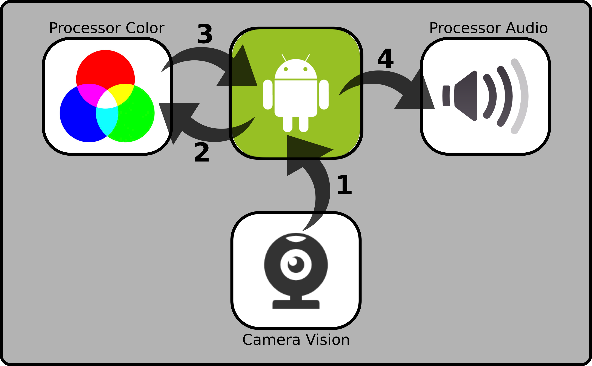
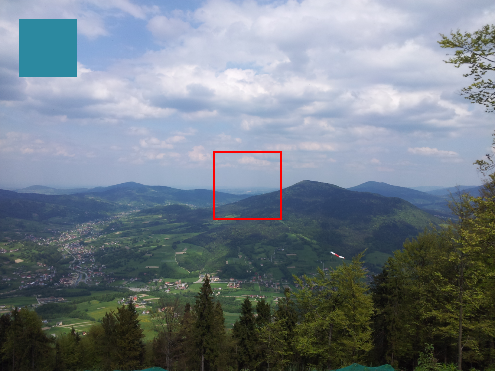
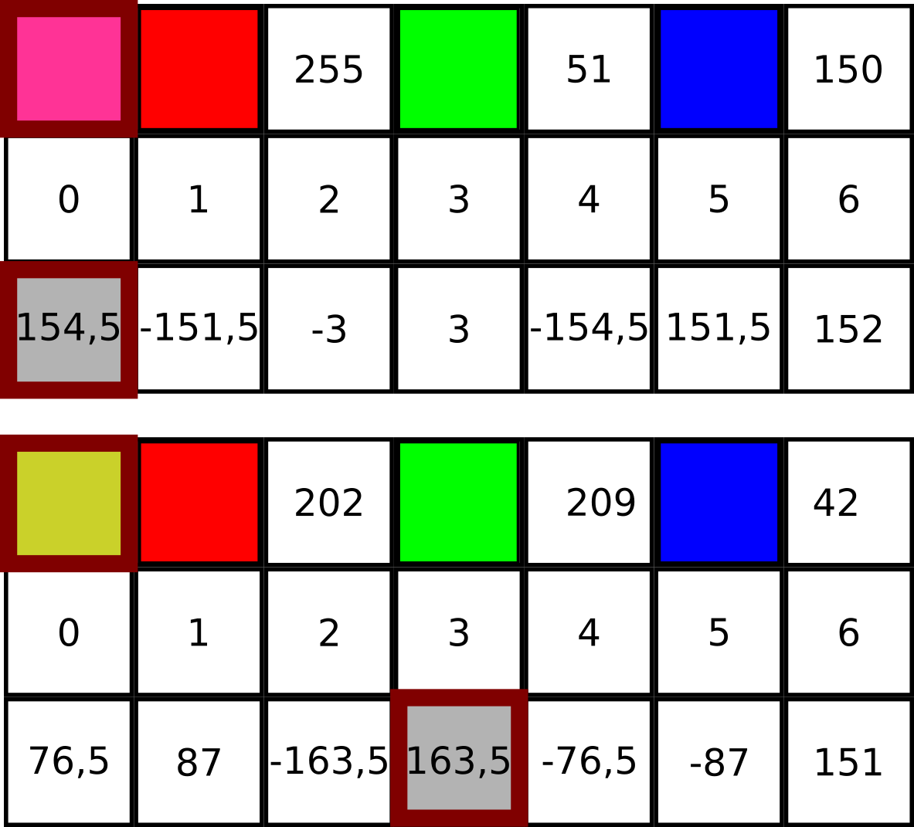

# hearVision

Wstęp
-----

Głównym celem oraz motywacją niniejszej pracy jest prezentacja aplikacji mobilnej umożliwiającej słyszenie kolorów. Bezpośrednią inspiracją powstania aplikacji jest wystąpienie Neila Harbisson’a ,,I listen to color” dostępne na platformie TED. W owej prezentacji referent przedstawia się jako cyborg, od dziecka nie widzący kolorów, który dzięki technologii może je słyszeć - jest to pewna substytucja bezpośrednich informacji dotyczących kolorów na dźwięki reprezentujące owe kolory. Dodatkowo, dzięki możliwościom, jakie daje jego proteza, widzi (czy raczej słyszy) w podczerwieni oraz ultrafiolecie.

W dzisiejszych czasach mamy do czynienia z pewnym kontinuum poglądów dotyczących możliwych ingerencji techniki w człowieka - począwszy od poglądów bezwzględnie krytykujących wszelką interwencję, poprzez przekonania zezwalające na przywrócenie normalnego funkcjonowania (np. wykorzystanie protezy), a na poglądach przemawiających za pełną cyborgizacją ludzi kończąc (co jest argumentowane np. brakiem chorób).

Samo zagadnienie substytucji wrażeń zmysłowych, które tu podejmujemy, wydaje mi się częścią protetyki, natomiast rozszerzenie dostępnych nam danych pochodzących z zewnętrznego świata (zwiększenie widma światła widzialnego, wyczuwanie fal radiowych) jest ściśle związane z koncepcją transhumanizmu i postczłowieka - dlatego tym zagadnieniom poświęcony został wstęp. Dalsza część pracy to przedstawienie budowy aplikacji oraz jej możliwości, z kolei koniec stanowi krótkie podsumowanie tematu.

### Protetyka

Protetyka jako dziedzina nauki zajmuje się ,,uzupełnianiem ubytków tkankowych, narządowych lub czynnościowych przy pomocy sztucznego materiału zastępczego (protezy)”. Wykorzystuje ona w tym celu osiągnięcia medycyny oraz techniki (w szczególności inżynierii biomedycznej). Co ciekawe, ponieważ człowiek nie jest bez wad - wszyscy wykorzystujemy jakąś protezę w życiu codziennym, mogą to być okulary (zastępujące poprawnie działające mięśnie odpowiadające za dopasowanie soczewki oka), ale równie dobrym przykładem, prawdopodobnie najpowszechniejszym, są plomby stomatologiczne (materiały wypełniające ubytki zębów).

Bardziej zaawansowanymi przykładami są protezy kończyn, które wykorzystują impulsy nerwowe dochodzące do pozostałej część kończyny, by jak najwierniej imitować naturalne ruchy. Jedną z protez tego typu jest C-Leg, która w czasie rzeczywistym monitoruje impulsy nerwowe docierające do końca kikuta, co pozwala na określenie w którym stadium ruchu znajduje się kończyna oraz pozwala na ewentualną korekcję protezy w stosunku do podłoża. Jestem zdania, że panuje powszechna zgoda na używanie protez, nawet tych ingerujących w ciało - jak implant ślimakowy wykorzystywany przez osoby z uszkodzonym uchem.

Przypadek Harbisson’a jest przykładem protezy czopków siatkówki, których funkcja jest wykonywana przez kamerę, komputer oraz (w dużym uproszczeniu) głośnik wpięty w kość czaszki. Logiczna jest zmiana jakościowa danych wzrokowych na dane słuchowe (standardowo przetwarzanych w zupełnie różnych obszarach mózgu), choć ze względu na plastyczność mózgu, możliwe są zmiany obszarów odpowiadających za dane funkcje. Znane są również przypadki ludzi posiadających zdolność synestezji, czyli umiejętności łączenia dźwięków z kolorami w sposób naturalny (jest to około 5% populacji). Warto zwrócić uwagę na fakt, że w przypadku Harvissona mamy do czynienia z substytucją, a nie - jak u synestetyków - współodczuwaniem.

### Transhumanizm i postczłowiek

Poglądy dotyczące nieograniczonej ingerencji w organizm człowieka reprezentują przedstawiciele ideologii transhumanizmu. Według Maxa More’a - jednego z wyznawców owej ideologii, jest to ,,klasa filozofii, które próbują kierować nas w stronę kondycji postludzkiej. Transhumanizm dzieli wiele elementów z humanizmem – przede wszystkim szacunek dla rozumu i nauki, nacisk na postęp i docenianie roli człowieczeństwa (czy transczłowieczeństwa) w życiu. Transhumanizm różni się od humanizmu przez przyzwolenie (a nawet oczekiwanie) na radykalne zmiany w naszej naturze i dostępnych nam możliwościach oferowanych przez różne nauki i technologie”. Jak łatwo zauważyć, przedstawiciele tego nurtu są zwolennikami cyborgizacji ludzi oraz nieograniczonego modyfikowania ludzkiego genomu, co powinno doprowadzić do polepszenia poziomu ludzkiej egzystencji, a także wykluczyć negatywne aspekty biologicznego organizmu ludzkiego (takie jak starzenie się, choroby czy ograniczone zdolności kognitywne).

Postulowany przez część myślicieli tego nurtu postczłowiek (np. Natasha Vita-More - Primo Posthuman) jest koncepcją udoskonalonego, poprzez rozwój techniki oraz inżynierii biomedycznej, człowieka jakiego do tej pory znamy - którego ciało jest naszpikowane najnowocześniejszą technologią umożliwiającą zarówno monitorowanie własnego stanu, otoczenia. Co prawda jest to ciągle wizja czysto teoretyczna, ale przy obecnym postępie technologicznym, przynajmniej część z postulatów Natashy - takich jak biosensory monitorujące czynności życiowe - można spróbować zrealizować, oczywiście przy zapewnieniu odpowiednich środków finansowych na badania.

Innym przedstawicielem filozofii transhumanizmu jest Stelios Arcadiou - artysta, który postanowił część ze swoich pomysłów wcielić w życie, konstruując mechaniczną trzecią rękę. Dzięki analizie sygnałów elektrycznych mięśni brzucha oraz ud zbieranych przez elektromiograf potrafi on sterować trzecią ręką (w pewnych ograniczonych wymiarach, ale projekt ten powstawał w latach 80 - dziś zapewne byłby bardziej zaawansowany technologicznie).

Koncepcja postczłowieka jest również obecna w grach komputerowych (niejako kształtujących obraz świata przyszłych pokoleń). W serii gier DeusEx możemy rozwijać naszego ludzkiego bohatera o dodatkowe moduły umożliwiające widzenie w noktowizji, szybką regenerację ran czy maskowanie termiczne, tym samym zyskując przewagę nad przeciwnikami.

Choć wizja człowieka, który w przypadku jakiejś awarii po prostu wymienia dany organ jest ciekawa, to jednak napawa obawami. Pomijając wszelkie kwestie związane z Bogiem oraz technologiczne, warto zastanowić się, czy możliwości jakie daje rozwój zostaną wykorzystane zgodnie z intencją twórców - dla budowania lepszego świata, czy jednak, chęć wzbogacenia się i podporządkowania sobie słabszych weźmie górę - co niejednokrotnie miało już miejsce w historii.

Między innymi z powodu owych wątpliwości co do sposobu wykorzystania technologii, jestem przeciwnikiem poglądów transhumanistycznych. Oczywiście w pewnych granicach nieingerujących w ludzką biologię oraz zmian tzw. hardwarowych, postęp technologiczny oraz ludzkie przystosowanie się do nowych technologii jest nieuniknione, a nawet byłoby głupstwem - dlaczego mielibyśmy nie skorzystać z dobrodziejstw jakie sobie dostarczamy? Jednak konsekwencji tzw. twardej ingerencji nie jesteśmy w stanie przewidzieć, dlatego nie powinniśmy zakładać, że będą one społecznie pozytywne - jeśli teoria ewolucji jest prawdziwa, to ludzki organizm samoistnie przystosuje się do otaczającego nas świata tak, jak to czynił do tej pory.

Z tego powodu czipy wszczepiane w czaszki (o ile nie są jedyną możliwością komunikowania się ze światem) nie wydają mi się dobrym rozwiązaniem. Nie widzę jednak żadnych przeciwwskazań, co do innych sposobów dostarczenia danych płynących z kolorów dla osób chorych na zaburzenia widzenia barwnego oraz tych, którzy po prostu chcieliby spróbować doświadczyć czegoś nowego. Aplikacja w formie, jaką zaimplementowano w niniejszej pracy umożliwia to - jednocześnie nie ingerując w ludzką naturę.

Projekt aplikacji
-----------------

Przed przystąpieniem do implementacji zagadnienia przeprowadzono poszukiwanie oprogramowania umożliwiającego słyszenie kolorów, niestety bez zadowalających rezultatów. Autor postanowił, zapełnić tę lukę i zaimplementować odpowiednie algorytmy.

Projekt aplikacji zakładał wykorzystanie platform mobilnych, które możemy zabrać ze sobą, by wskazywać interesujący nas fragment pola widzenia. Jako środowisko działania aplikacji wykorzystano telefon z systemem Android - wynika to z dostępności takich urządzeń, łatwości implementacji interesującego zagadnienia w tym środowisku oraz doświadczenia autora. Minimalna wersja systemu na którym aplikacja będzie działać posiada numer 4.4, co powoduje, że 80% wszystkich urządzeń pracujących pod systemem Android będzie obsługiwało program.

Oprócz standardowych bibliotek umożliwiających tworzenie aplikacji, dodatkowo wykorzystano zbiór klas dostarczanych przez OpenCV (Open Source Computer Vision). Jest to łatwa w obsłudze biblioteka do obliczeń graficznych wykonywanych w czasie rzeczywistym, czyli bezpośrednio przechwytujących obraz kamery, bez zapisywania go w trwałej pamięci urządzenia.

Implementacja
-------------

Poprawne działanie aplikacji oraz jej implementacja zgodna z zasadami Programowania Zorientowanego Obiektowo wymagała napisania trzech niezależnych modułów, które komunikują się ze sobą poprzez moduł główny. Dzięki takiej architekturze, możliwa jest podmiana każdej z klas niezależnie od innych, co jest istotne w przypadku dalszego rozwoju aplikacji.

Podstawowy obieg informacji w aplikacji przedstawia rysunek [fig:projekt aplikacji]. Jak łatwo zauważyć program wykonuje kolejno cztery działania: (1) pobranie zdjęcia z kamery głównej telefonu; (2) przesłanie rysunku do obiektu ProcessorColor w celu analizy; (3) odebranie informacji dotyczącej koloru centralnej części obrazu; (4) przesłanie informacji o kolorze do modułu ProcessorAudio generującego odpowiedni dźwięk. Implementacja modułów została opisana poniżej.

 [fig:projekt aplikacji]

Istotna jest stałość kolorów oraz dźwięków - tak, żeby konkretne kolory odpowiadały konkretnym, niezmiennym dźwiękom. Aby uniknąć kakofonii, moduł ProcessorAudio ma zaimplementowaną tablicę zawierającą dźwięki gamy C-dur oraz odpowiadające im częstotliwości [fig:cdur]. Główna pętla przesyła informacja z kamery do modułu rozpoznającego kolor, natomiast informacje o kolorze do modułu odpowiedzialnego za generowanie dźwięku.

 [fig:cdur]

### Uśrednianie koloru

W aplikacji wykorzystano fragmenty kodu SampleCV-Color Blob Detection oraz standard kodowania kolorów RGB. W tym formacie każdy piksel ma zapisaną informację o nasileniu składowych kolorów (czerwonej, zielonej oraz niebieskiej). Dzięki temu uśrednienie koloru wymaga prostego przejścia przez wszystkie piksele w interesującej nas matrycy, dodaniu wszystkich wartości danej składowej koloru oraz podzieleniu przez ilość branych pod uwagę pikseli.

Na rysunku [fig:okno aplikacji] przedstawiono widok okna aplikacji. W lewym górnym rogu zaprezentowany jest uśredniony kolor centralnej części widoku z kamery. W centralnej części widać obszar pikseli branych pod uwagę przy uśrednianiu koloru.

 [fig:okno aplikacji]

Drugą interesującą kwestią jest algorytm wyboru uśrednionego koloru, jaki znajduje się w interesującym nas obszarze. Jest to istotne dlatego, że odpowiedni kolor ma przyporządkowany stały dźwięk w klasie ProcessorAudio. Jak łatwo zauważyć w listing’u 1, do prawidłowego wytypowania jednego z siedmiu kolorów (czerwonego, zielonego, niebieskiego, żółtego, cyjanowego, magenty oraz szarości - którym odpowiadają tony dźwięków) również wykorzystano standard RGB.

``` {caption="Zaimplementowany" kod="" wyboru="" koloru=""}
private int compareAll(double red, double green, double blue){
   int result=0;
   double[] comp = new double[7];
   comp[0] = red - (green + blue)/2; // red
   comp[1] = green - (blue + red)/2; // green
   comp[2] = blue - (red + green)/2; // blue
   comp[3] = (red + green)/2 - blue; // yellow
   comp[4] = (green + blue)/2 - red; // cyan
   comp[5] = (blue + red)/2 - green; // magenta
   comp[6] = (red+green+blue)/3;     // gray_scale
   for (int i = 1; i< comp.length; i++){ // because 0 is default
       if(comp[result]>comp[i]){
           result = i;
       }
    }
   return result;
}
```

Do kolejnych komórek tabeli ,,comp” zostają zapisane różnice między natężeniem poszczególnych kolorów. Następnie wykonana zostaje pętla sprawdzająca w której komórce wartość jest największa - numer tej komórki wskazuje, który kolor dominuje w interesującym nas fragmencie obrazu. Stany poszczególnych komórek tabeli ,,comp” na dwóch przykładach obrazuje rysunek [fig:tabprzyklad] - dodatkowo, bordową ramką zaznaczono na nim numer zwróconej w funkcji komórki.

 [fig:tabprzyklad]

### Generowanie dźwięku

Jak już wspomniano, aplikacja w celu uniknięcia nieprzyjemnej dla słuchacza kakofonii, wykorzystuje częstotliwości dźwięków gamy C-dur generowanych na bieżąco (zob. rysunek [fig:cdur]), gdy użytkownik nakieruje kamerę telefonu na jakiś kolor. W aplikacji wykorzystano dostarczony przez Google specjalny zestaw klas, dzięki którym możemy wygenerować dźwięk o teoretycznie każdej częstotliwości, uzupełniony o tablicę częstotliwości dźwięków w interesującej nas skali.

Działanie tego modułu składa się z 2 funkcji: setFrequency (ustawiającej częstotliwość generowanego dźwięku) oraz start (uruchamiający dźwięk na określony czas). W tym miejscu warto zaznaczyć, że próbkowanie (rozumiane jako wykonywanie kolejnych zrzutów obrazu z kamery na podstawie których generowany jest dźwięk) odbywa się co 500 ms - czas ten można dowolnie zmienić zmieniając odpowiednią wartość w kodzie. Jednakże praktyka wykazuje, że przy większym próbkowaniu (krótszym czasie między analizowanymi zdjęciami) dźwięk nie zdąży wybrzmieć, natomiast przy dłuższym czasie między zbieranymi próbkami - nie każdy kolor możemy wychwycić, ze względu na szybkość zmiany otoczenia.

Podsumowanie
------------

Podsumowując, w coraz szybciej zmieniającej się rzeczywistości coraz większa integracja człowieka z komputerami jest nieunikniona. Myślę jednak, że warto i w tej dziedzinie zachować zdrowy rozsądek, by pewnego dnia nie okazało się, że ludzie pozbawieni kontaktu z siecią i komputerami (np. w przypadku globalnej awarii) są bezradni.

Kończąc pracę, chciałbym wyrazić nadzieję, że aplikacja, mimo swojej prostoty, przyczyni się to tego, że część osób mająca problemy z widzeniem barwnym (a jest to ponad 8% populacji) odnajdzie sposób dostarczenia dodatkowych informacji o pięknie świata w sposób nieinwazyjny oraz nieszkodliwy dla ich zdrowia.
